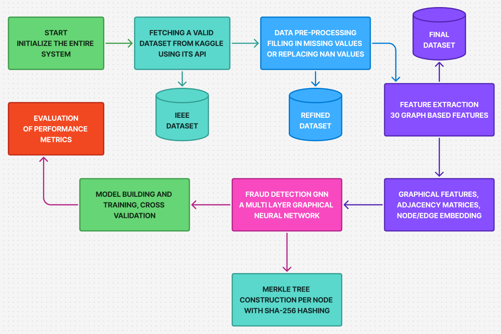

# A Comparative Study on Fraud Detection Models using GNN with Merkle Tree Hashing on Transaction Graphs

**A hybrid Graph Neural Network framework for financial fraud detection using transaction graphs, enriched with per-node Merkle Tree hashing for transaction integrity and tamper resistance.**



---

## 📋 Overview

This project implements a complete end-to-end fraud detection system that combines:

- **Cryptographic security** via per-user Merkle Trees (SHA-256)
- **Graph representation learning** using NetworkX
- **Advanced Graph Neural Networks** (GAT + GraphSAGE)
- **21 hand-crafted node features** (topology, transaction, temporal & anomaly)

The system automatically downloads the dataset using `kagglehub` using its API and works out-of-the-box.

---

## ✨ Key Features

- **Merkle Tree Hashing** – Generates a cryptographic root hash for every user’s transaction history to ensure integrity and enable tamper-proof verification
- **Automatic Dataset Download** – Uses `kagglehub` 
- **Synthetic User & Merchant ID Generation** – Creates realistic graph structure from anonymized data
- **21 Rich Node Features** – Topology, transaction statistics, temporal patterns, and anomaly detection features
- **Hybrid GNN Architecture** – Graph Attention Network (GAT) + GraphSAGE with residual connections
- **Class-weighted training** – Handles severe class imbalance (0.173% fraud rate)
- **Clean & Modular Code** – Easy to extend or test on other datasets

---

## 🔄 Pipeline

The complete workflow is shown in the flowchart above:

1. **Dataset Download** (KaggleHub)
2. **Data Preprocessing & Identifier Creation**
3. **Directed Graph Construction**
4. **Per-User Merkle Tree Hashing**
5. **Feature Extraction (21 features per node)**
6. **PyTorch Geometric Data Preparation**
7. **GNN Training (50 epochs)**
8. **Evaluation (Accuracy, Precision, Recall, F1-Score)**

---

## 📊 Datasets Tested

The system has been tested on the following datasets:

- **ULB Credit Card Fraud Detection**
- IEEE-CIS Fraud Detection
- Elliptic Bitcoin Transaction Network

---

## 🚀 Installation & Usage

```bash
# 1. Clone the repository
git clone https://github.com/your-username/Fraud_Detection_using_GNN_and_Merkle_Tree.git
cd Fraud_Detection_using_GNN_and_Merkle_Tree

# 2. Create virtual environment (recommended)
python -m venv venv
source venv/bin/activate    # Windows: venv\Scripts\activate

# 3. Install dependencies
pip install torch torchvision torchaudio --index-url https://download.pytorch.org/whl/cpu
pip install torch-geometric networkx pandas numpy kagglehub matplotlib

# 4. Run the system
python GNN.py
